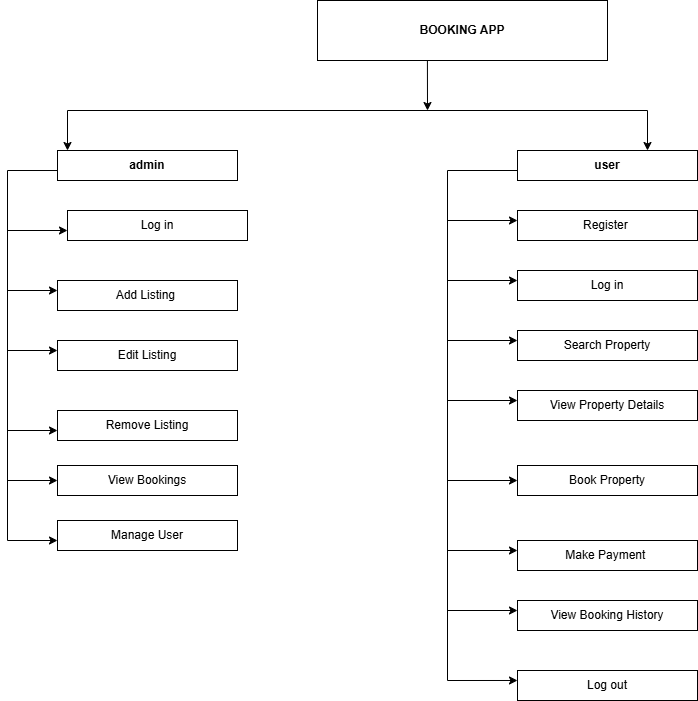

# Requirement Analysis in Software Development

This repository explores the essential phase of requirement analysis in the software development lifecycle (SDLC). It includes concepts, types of requirements, key activities, and a practical example using a booking management system.
## What is Requirement Analysis?

Requirement Analysis is the process of identifying, gathering, analyzing, and documenting the needs and expectations of stakeholders for a new or modified product. It serves as the foundation for designing and developing software that meets user needs.

In the Software Development Lifecycle (SDLC), this phase ensures clear understanding among all stakeholders and helps avoid miscommunication, which can lead to project failure. Requirement Analysis acts as a blueprint for developers, testers, and designers.
## Why is Requirement Analysis Important?

1. **Reduces Risk of Failure**  
   Understanding the exact requirements ensures the product meets stakeholder needs, avoiding costly changes later.

2. **Improves Communication**  
   Establishes a shared understanding between clients, developers, and testers, reducing assumptions.

3. **Enhances Planning and Budgeting**  
   Well-defined requirements enable accurate project estimation for resources, time, and cost.

## Key Activities in Requirement Analysis

- **Requirement Gathering**  
  Collecting information from stakeholders through interviews, surveys, or observation.

- **Requirement Elicitation**  
  Refining and analyzing gathered data to uncover hidden or implicit requirements.

- **Requirement Documentation**  
  Writing clear, detailed requirements in a structured format such as SRS documents or user stories.

- **Requirement Analysis and Modeling**  
  Categorizing and prioritizing requirements, using models (like use cases) to visualize them.

- **Requirement Validation**  
  Ensuring the documented requirements are correct, complete, and agreed upon by stakeholders.
## Types of Requirements

### Functional Requirements

These describe what the system should do.

**Examples (Booking Management System):**
- User can search for available properties.
- User can register and log in.
- Admin can add or remove listings.

### Non-functional Requirements

These describe how the system should behave.

**Examples:**
- Page load time should be under 2 seconds.
- The system should support 1000 concurrent users.
- Data should be encrypted during transmission (security).

## Use Case Diagrams

Use Case Diagrams visualize the interaction between users (actors) and the system. They help stakeholders understand the system’s functional scope.

## Acceptance Criteria

Acceptance Criteria are predefined conditions that a product feature must satisfy to be accepted by users or stakeholders. They ensure clarity in what needs to be delivered and help testers verify the functionality.

**Example (Checkout Feature in Booking System):**
- User must be logged in to access the checkout.
- User can review property details before confirming.
- Payment must be processed through a secure gateway.
- Confirmation email is sent after successful booking.

